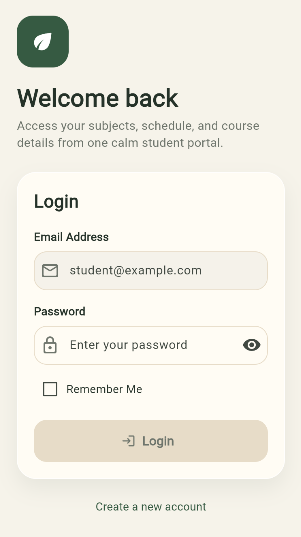
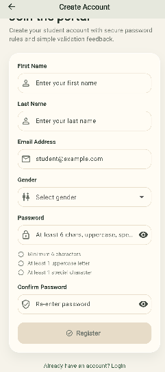
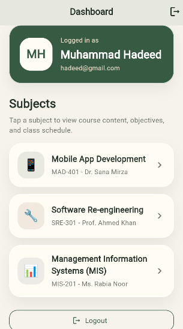
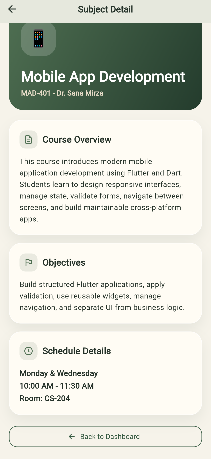

# Campus Course Portal

A Flutter Multi-Screen Authentication Application

## Student Information

- **Name:** Muhammad Hadeed
- **Class:** BSSE-8B
- **Student ID:** SE221003

## Project Overview

Campus Course Portal is a simple and clean Flutter application built for the Multi-Screen Application Development assignment. The application includes user registration, login authentication, form validation, Remember Me session persistence, dashboard navigation, and subject detail screens.

The project follows a structured architecture with separated UI code, validation logic, controller/service classes, reusable widgets, and enums.

## Features Implemented

- Registration screen with First Name, Last Name, Email Address, Gender, Password, and Confirm Password fields
- Email format validation
- Secure password validation:
  - Minimum 6 characters
  - At least 1 uppercase letter
  - At least 1 special character
- Confirm password matching
- Real-time validation feedback
- Register button remains disabled until the form is valid
- Success message after successful registration
- Login screen with email validation
- Password show/hide toggle using eye icon
- Remember Me checkbox
- Basic session persistence using `shared_preferences`
- Dashboard screen showing user name and avatar placeholder
- Dynamic subject list:
  - Mobile App Development
  - Software Re-engineering
  - Management Information Systems (MIS)
- Subject detail screen with subject header, banner placeholder, description, objectives, and schedule details
- Logout functionality
- Reusable custom validator class
- Enum implementation for gender, authentication state, and subject category
- Controller/service layer for authentication, form handling, subject data, and navigation logic

## Application Screens

### 1. Registration Screen

The Registration Screen allows the user to create an account by entering first name, last name, email address, gender, password, and confirm password. The form validates all fields and enables the Register button only when the complete form is valid.

### 2. Login Screen

The Login Screen allows the registered user to log in using email and password. It includes email validation, password validation, a show/hide password icon, and a Remember Me checkbox for basic session persistence.

### 3. Dashboard Screen

The Dashboard Screen displays the logged-in user's name, an avatar placeholder, and a dynamic list of subjects. Tapping a subject opens the Detail Screen and passes the selected subject data.

### 4. Detail Screen

The Detail Screen displays the selected subject name, banner placeholder, course description, learning objectives, and class schedule details.

## Screenshots

The following screenshots show the main screens of the Campus Course Portal application.

### Authentication Screens

<table>
  <tr>
    <td align="center"><b>Login Screen</b></td>
    <td align="center"><b>Registration Screen</b></td>
  </tr>
  <tr>
    <td align="center">
      
    </td>
    <td align="center">
      
    </td>
  </tr>
</table>

### Application Screens

<table>
  <tr>
    <td align="center"><b>Dashboard Screen</b></td>
    <td align="center"><b>Course Detail Screen</b></td>
  </tr>
  <tr>
    <td align="center">
      
    </td>
    <td align="center">
      
    </td>
  </tr>
</table>

## Folder Structure

````text
lib/
├── controllers/
│   ├── auth_controller.dart
│   ├── form_controller.dart
│   ├── navigation_controller.dart
│   └── subject_data.dart
├── enums/
│   └── app_enums.dart
├── models/
│   ├── subject_model.dart
│   └── user_model.dart
├── screens/
│   ├── dashboard_screen.dart
│   ├── detail_screen.dart
│   ├── login_screen.dart
│   └── register_screen.dart
├── theme/
│   └── app_theme.dart
├── validators/
│   └── app_validator.dart
├── widgets/
│   └── app_widgets.dart
└── main.dart

## How to Run

```bash
flutter pub get
flutter run
````

## Testing Checklist

1. Register a new user with valid data.
2. Try invalid email and weak passwords to confirm validation messages.
3. Confirm the Register button remains disabled until all fields are valid.
4. Log in using registered credentials.
5. Toggle password visibility on the Login screen.
6. Check Remember Me and restart the app to verify session persistence.
7. Open Dashboard and tap each subject.
8. Confirm Detail screen receives and displays the selected subject.
9. Logout and confirm the app returns to Login screen.
